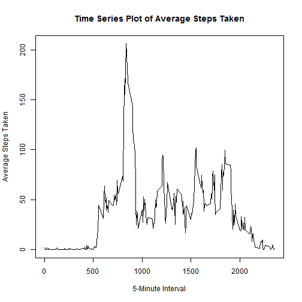

## Peer Graded Assignment - Course Project 1


###
### Loading and preprocessing the data
###

```r
datActivity <- read.csv(file="data\\activity.csv", head=TRUE, sep=",")
```


###
### What is mean total number of steps taken per day?
###
1. Calculate the total number of steps taken per day

```r
datStepsByDate <- aggregate(steps ~ date, data=datActivity, sum, na.rm=TRUE)
head(datStepsByDate,10)
```

```
##          date steps
## 1  2012-10-02   126
## 2  2012-10-03 11352
## 3  2012-10-04 12116
## 4  2012-10-05 13294
## 5  2012-10-06 15420
## 6  2012-10-07 11015
## 7  2012-10-09 12811
## 8  2012-10-10  9900
## 9  2012-10-11 10304
## 10 2012-10-12 17382
```

2. If you do not understand the difference between a histogram and a barplot, research the difference between them. Make a histogram of the total number of steps taken each day


```r
hist( datStepsByDate$steps, 
      main="Histogram of Steps Taken Each Day", 
      xlab="Number of Steps", 
      ylab="Frequency", 
      col="green")
```

 

3. Calculate and report the mean and median of the total number of steps taken per day

```r
mean(datStepsByDate$steps)
```

```
## [1] 10766.19
```

```r
median(datStepsByDate$steps)
```

```
## [1] 10765
```


###
### What is the average daily activity pattern?
###
1. Make a time series plot (i.e. type = "l") of the 5-minute interval (x-axis) and the average number of steps taken, averaged across all days (y-axis)


```r
datAvgStepsByInterval <- aggregate(steps ~ interval, data=datActivity, mean, na.rm=TRUE)
head(datAvgStepsByInterval,10)
```

```
##    interval     steps
## 1         0 1.7169811
## 2         5 0.3396226
## 3        10 0.1320755
## 4        15 0.1509434
## 5        20 0.0754717
## 6        25 2.0943396
## 7        30 0.5283019
## 8        35 0.8679245
## 9        40 0.0000000
## 10       45 1.4716981
```

```r
plot(  x=datAvgStepsByInterval$interval,
       y=datAvgStepsByInterval$steps,
       type="l",
       xlab="5-Minute Interval",
       ylab="Average Steps Taken",
       main="Time Series Plot of Average Steps Taken" )
```

 

2. Which 5-minute interval, on average across all the days in the dataset, contains the maximum number of steps?


```r
maxSteps = max(datAvgStepsByInterval$steps)
maxStepsInterval = datAvgStepsByInterval[ datAvgStepsByInterval$steps == maxSteps, 1 ]
maxStepsInterval
```

```
## [1] 835
```


###
### Imputing missing values
###
1. Calculate and report the total number of missing values in the dataset (i.e. the total number of rows with NAs)


```r
# show the count of missing values
sum(is.na(datActivity))
```

```
## [1] 2304
```

2. Devise a strategy for filling in all of the missing values in the dataset. The strategy does not need to be sophisticated. For example, you could use the mean/median for that day, or the mean for that 5-minute interval, etc.

3. Create a new dataset that is equal to the original dataset but with the missing data filled in.


```r
# create a new dataset called datActivity2, which will contain filled values for NAs
datActivity2 <- datActivity

# fill in values for the NAs
for (i in 1:nrow(datActivity)) {
  if (is.na(datActivity$steps[i])) {
    intIndex = which(datActivity$interval[i] == datAvgStepsByInterval$interval)    
    datActivity2$steps[i] <- datAvgStepsByInterval[intIndex,2]
  }
}
head(datActivity2,10)
```

```
##        steps       date interval
## 1  1.7169811 2012-10-01        0
## 2  0.3396226 2012-10-01        5
## 3  0.1320755 2012-10-01       10
## 4  0.1509434 2012-10-01       15
## 5  0.0754717 2012-10-01       20
## 6  2.0943396 2012-10-01       25
## 7  0.5283019 2012-10-01       30
## 8  0.8679245 2012-10-01       35
## 9  0.0000000 2012-10-01       40
## 10 1.4716981 2012-10-01       45
```

4. Make a histogram of the total number of steps taken each day and Calculate and report the mean and median total number of steps taken per day. Do these values differ from the estimates from the first part of the assignment? What is the impact of imputing missing data on the estimates of the total daily number of steps? 


```r
datStepsByDate2 <- aggregate(steps ~ date, data=datActivity2, sum, na.rm=TRUE)
head(datStepsByDate2,10)
```

```
##          date    steps
## 1  2012-10-01 10766.19
## 2  2012-10-02   126.00
## 3  2012-10-03 11352.00
## 4  2012-10-04 12116.00
## 5  2012-10-05 13294.00
## 6  2012-10-06 15420.00
## 7  2012-10-07 11015.00
## 8  2012-10-08 10766.19
## 9  2012-10-09 12811.00
## 10 2012-10-10  9900.00
```

**Remark: The impact of imputing missing data with the mean for the 5-minute interval causes the increase in counts for the 10766-step days (e.g. see steps of 2012-10-01 and 2012-10-08 above).  Such an increase is also evident in the new histogram #2 below (see the increase in Frequency for the 10,000 and 15,000 range).**


```r
# The histogram is now
hist( datStepsByDate2$steps, 
      main="Histogram of Steps Taken Each Day (#2)", 
      xlab="Number of Steps", 
      ylab="Frequency", 
      col="green")
```

 

```r
# The mean value is now
mean(datStepsByDate2$steps)
```

```
## [1] 10766.19
```

```r
# The median value is now
median(datStepsByDate2$steps)
```

```
## [1] 10766.19
```


###
### Are there differences in activity patterns between weekdays and weekends?
###
1. Create a new factor variable in the dataset with two levels - "weekday" and "weekend" indicating whether a given date is a weekday or weekend day.


```r
datActivity2$weeklevel <- "?"  
for (i in 1:nrow(datActivity2)) {
  weekday <- weekdays(as.Date(datActivity2[i,]$date))
  if (weekday %in% c("Saturday", "Sunday") ) {
    datActivity2$weeklevel[i] <- "Weekend"
  } else if (weekday %in% c("Monday", "Tuesday", "Wednesday", "Thursday", "Friday"))  {
    datActivity2$weeklevel[i] <- "Weekday"
  } else {
    datActivity2$weeklevel[i] <- "?"
  }
}
head(datActivity2,10)
```

```
##        steps       date interval weeklevel
## 1  1.7169811 2012-10-01        0   Weekday
## 2  0.3396226 2012-10-01        5   Weekday
## 3  0.1320755 2012-10-01       10   Weekday
## 4  0.1509434 2012-10-01       15   Weekday
## 5  0.0754717 2012-10-01       20   Weekday
## 6  2.0943396 2012-10-01       25   Weekday
## 7  0.5283019 2012-10-01       30   Weekday
## 8  0.8679245 2012-10-01       35   Weekday
## 9  0.0000000 2012-10-01       40   Weekday
## 10 1.4716981 2012-10-01       45   Weekday
```

2. Make a panel plot containing a time series plot (i.e. type = "l") of the 5-minute interval (x-axis) and the average number of steps taken, averaged across all weekday days or weekend days (y-axis). See the README file in the GitHub repository to see an example of what this plot should look like using simulated data.


```r
datAvgStepsByInterval2 <- aggregate(steps ~ interval + weeklevel, data = datActivity2, mean)
names(datAvgStepsByInterval2) <- c("interval", "weeklevel", "steps")

library(lattice)
xyplot(steps ~ interval | weeklevel, datAvgStepsByInterval2, type = "l", layout = c(1, 2), 
       xlab = "Interval of 5-Minute", ylab = "Average Number of Steps", 
       main="Weekdays and Weekends Time Series Plot")
```

 


